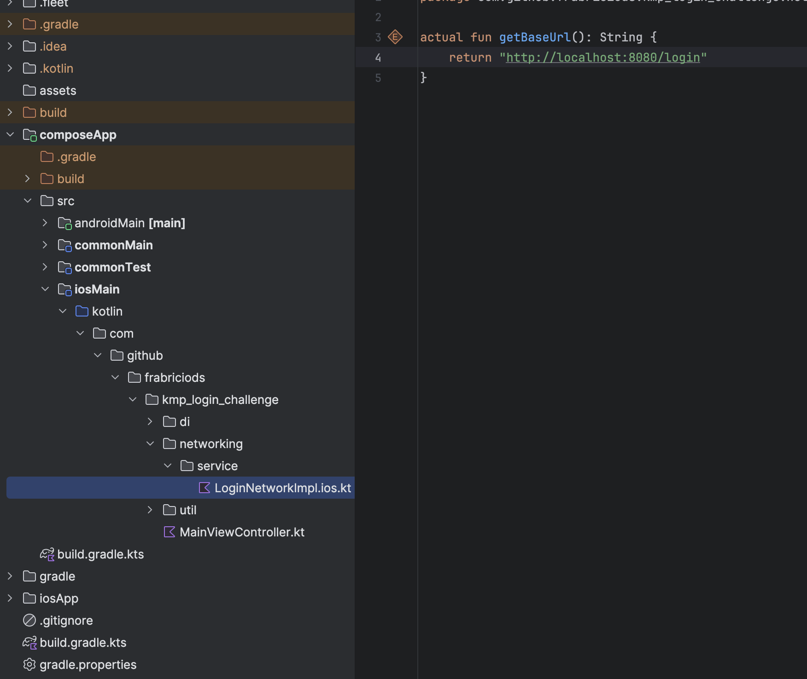
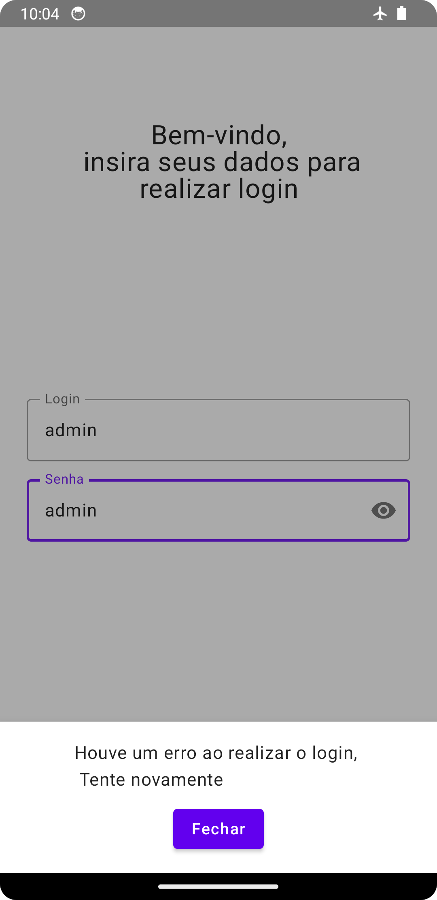
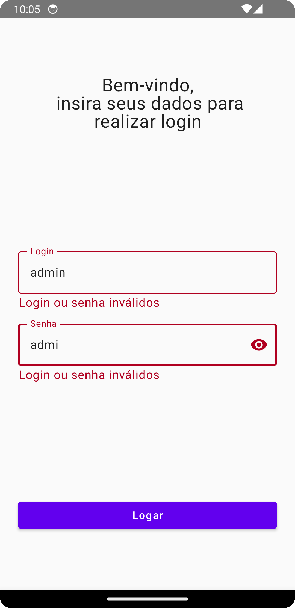
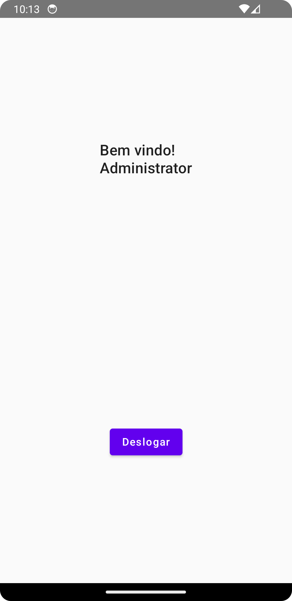
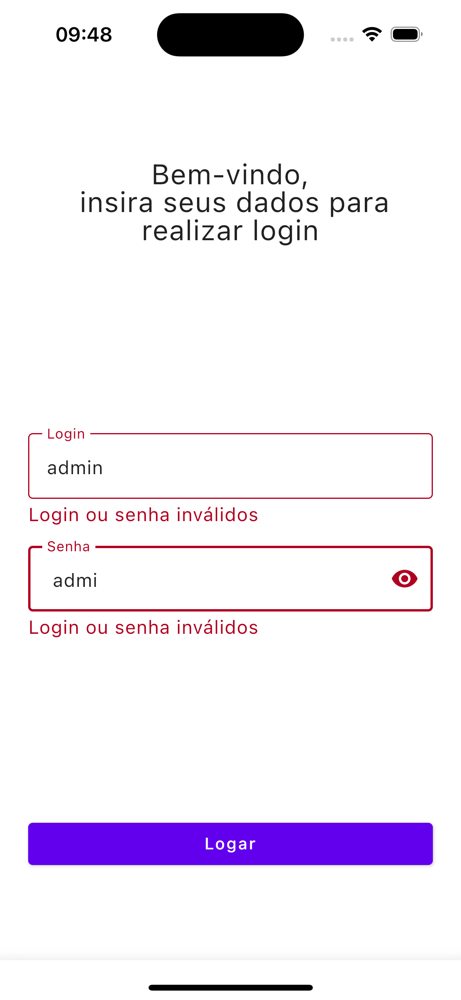
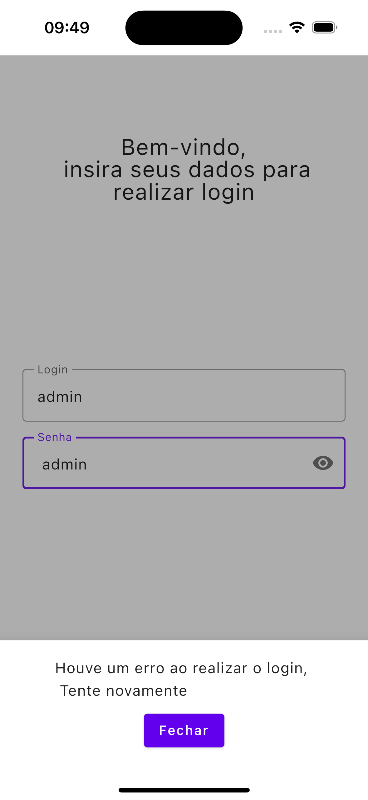
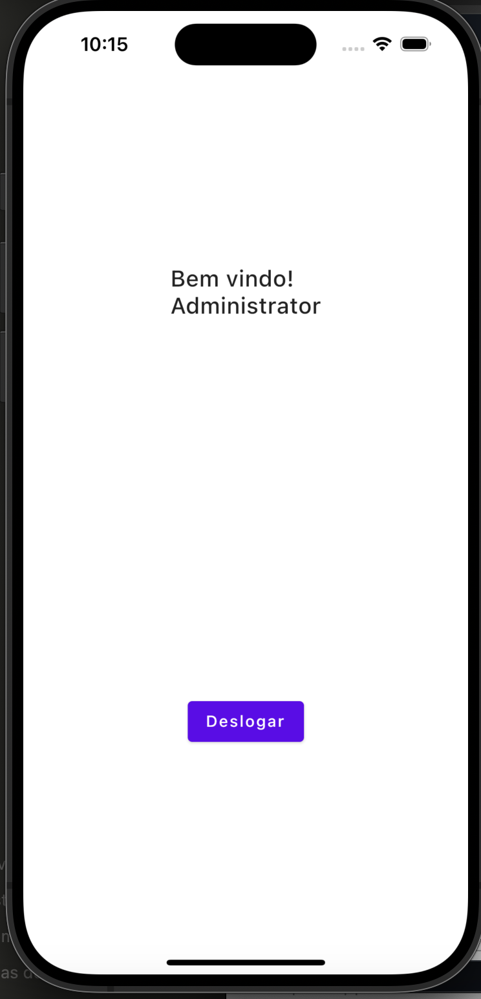

# Projeto KMP Compose Multiplatform

Este projeto de um projeto em KMP + Compose Multiplataforma capaz de realizar login e utilizar armazenamento local.
**Importante** Para rodar essa aplicação é necessário estar rodando a API [Login Challenge](https://github.com/Fabriciods/KMP-Login-Challenge) na porta **8080**
caso necessite rodar em outra porta, basta ajustar os arquivos `LoginNetWorkingImpl` da pasta android main e iOS main.
 

 
Projeto foi testado utilizando emuladores android e iOS

## 🛠️ Recursos do projeto

- **Kotlin Multiplatform (KMP)**
- **Compose Multiplatform**
- **Controle de estado com Compose**
- **Injenção de dependência com koin**
- **Consumo de API com KTOR**
- **Armazenamento local Nativo no android(sharedPreferences) e iOS(NSUUserDefaults)**
- **Testes Unitários**
- **Arquitetura MVVM**
- **Compose Navigation**
- **Componetização**

## 🛠️ Estrutura do projeto
Projeto Utiliza arquitetura MVVM senda aplicada nos modulos CommomMain, androidMain e iOSMain
- **DI** Responsavél pela injeção de dependência utilizando koin, `expect val targetModule: Module` permite que cada módulo faças suas impelmentações e injeção dos modulos, como ocorre com  OkHttpClient que android e iOS possui suas proprias configurações.
- **Networking** Camada responsavél pela comunicação com a API.
- **Domain** Camada Responsável pela comunicação do presentation com networking.
- **Presentation** Possui toda a ui e componentes relacionados, como viewModel, navigation, e componentes reutilizaveis como bottomSheet e o Input de texto. Está estruturada por contexto, home e login. 
- **Util** Esse diretório possui os componentes utilizados em mais de uma camada, como a `interface result` que é um handler para lidar com os estados das requisições como casos de erro com `BaseError` para gerenciar erros de login inválidos ou demais erros. 
Nesse repositório se encontra a classe `UserPreference` que é implementada em cada plataforma para realizar a manipulações de dados locais de forma nativa no android e iOS.

** Testes 
Foram adicionados testes para cada camada do projeto estruturados dentro de commonTest 

## 📋 Capturas de tela
**Android** 

  
**iOS**

